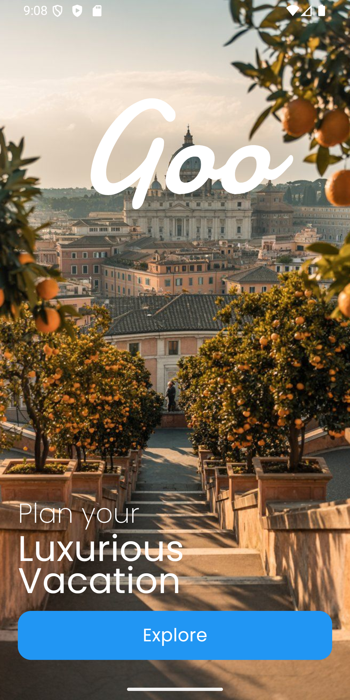
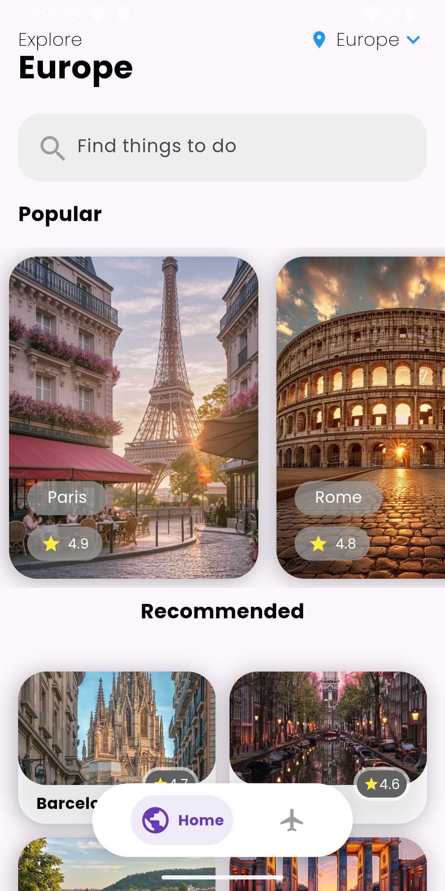

  

  
  
  

## 🚀 Sobre o projeto
Goo App é um aplicativo desenvolvido em Flutter com o objetivo de colocar em prática meus estudos na criação de apps modernos.
O app utiliza Provider para gerenciamento de estado e simula um sistema de reserva de viagens, permitindo que usuários explorem cidades, façam pedidos de viagens e acompanhem suas reservas de forma intuitiva e organizada.

## 📦 Funcionalidades
- Explorar cidades da Europa com informações detalhadas.
- Realizar pedidos de viagem de maneira simples e rápida.
- Visualizar e gerenciar todas as reservas realizadas.
- Experiência fluida com animações suaves e responsivas.

## 🤝 Contato

  
  

## 📷 Screenshots

  
  

